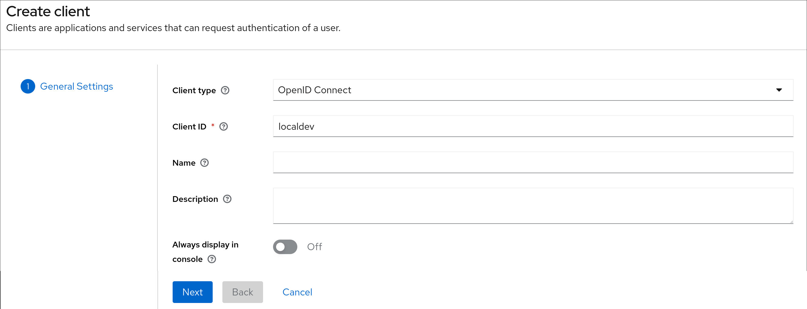
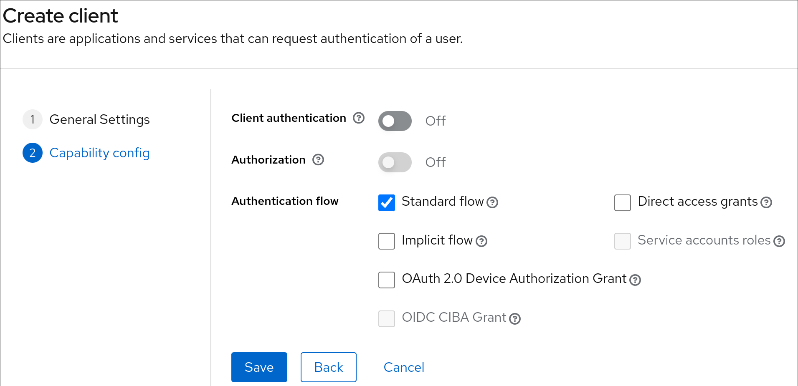
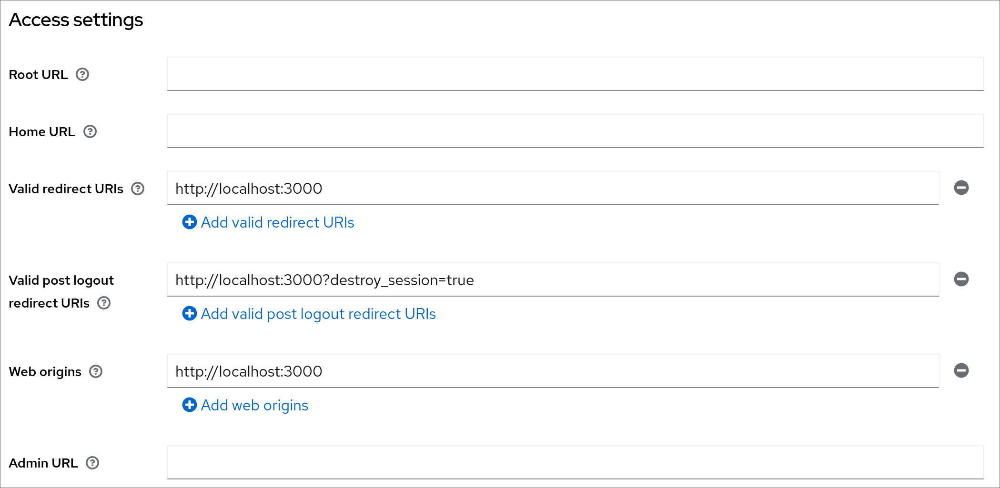

# KeyCloak

This guide should help you setting up **leptos_oidc** with [KeyCloak](https://github.com/sebadob/rauthy).

## Setup your KeyCloak

You can find a guide to [setup KeyCloak](https://www.keycloak.org/getting-started/getting-started-docker),
all you need to do is setting up a realm. The client part will be explained here.

## Setup KeyCloak

Setting up KeyCloak is quite easily, all you need to do is creating a new
client. In this example we will call that client localdev. \
{width=50%}

This step is optional, you can disable the `direct access grant`, but you don't
need to do it when you are working with **leptos_oidc** \
{width=50%}

After creating the new client, all you need to do is adding the `Valid redirect
URIs`, `Valid post logut redirect URIs` and `Web origins`. Please keep in mind
that you need to add the `?destroy_session=true` at the end of the domain, this
will be added automatically from the **leptos_oidc** library and is mandatory.
And of course, don't forget to save at the end. \
{width=50%}

## Setup leptos_oidc

All you need to do is to setup everything with the init function. In this
example the config would look like this:

```rust
use leptos::*;
use leptos_oidc::Auth;

#[component]
pub fn App() -> impl IntoView {
    provide_meta_context();

    view! {
        <Stylesheet id="leptos" href="/pkg/main.css"/>

        <Link rel="shortcut icon" type_="image/ico" href="/favicon.ico"/>

        <Router>
            <AppWithRouter/>
        </Router>
    }
}

#[component]
pub fn AppWithRouter() -> impl IntoView {
    // Specify OIDC authentication parameters here.
    // Note: This is an example for keycloak, please change it to your needs
    let auth_parameters = AuthParameters {
        issuer: "http://localhost:8080/auth/realms/myrealm".to_string(),
        client_id: "localdev".to_string(),
        redirect_uri: "http://localhost:3000".to_string(),
        post_logout_redirect_uri: "http://localhost:3000".to_string(),
        scope: None,
        audience: None,
    };
    let auth = Auth::init(auth_parameters);

    view! {
        // Your stuff
    }
}
```

Please keep in mind to set your realm correctly, otherwise it won't work.
